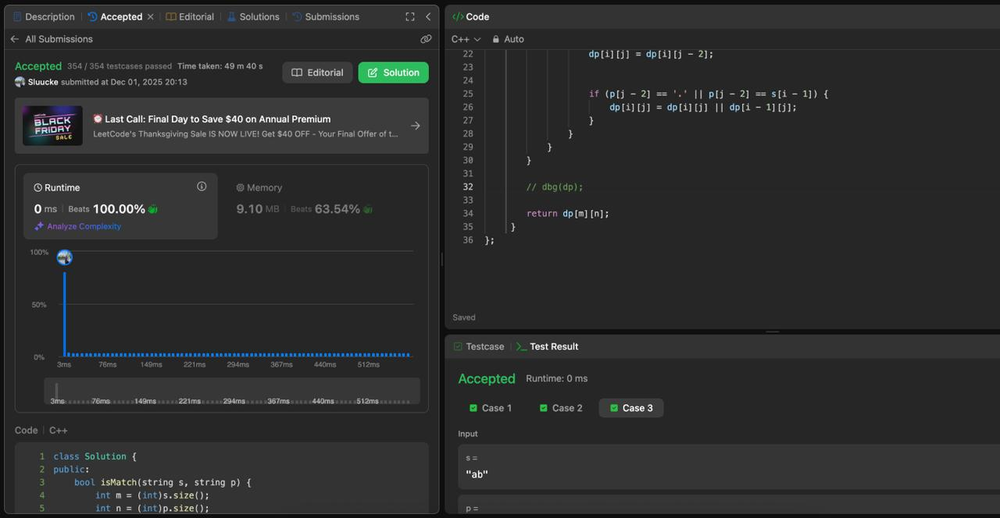
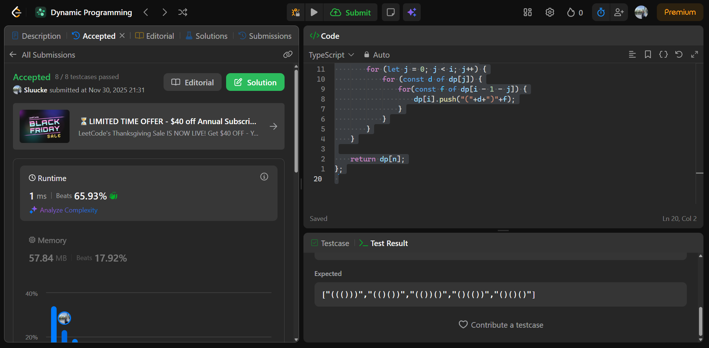
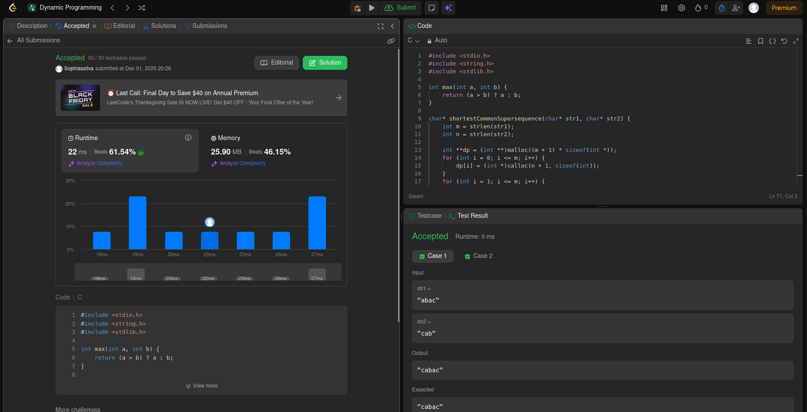

# Programação Dinâmica

**Número do trabalho:** 5  
**Conteúdo: Programação Dinamica**

## Discentes

| Matrícula |        Nome Completo         |
|:---------:|:----------------------------:|
| 232001649 | David William Lemos Ferreira |
| 231026886 | Sophia Souza da Silva        |

## Definição do Trabalho

Para este quinto trabalho, decidimos resolver questões do leetcode.

## Linguagens utilizadas

Utilizamos as linguagens C++ e C para resolução das questões.

## Questões

| Questão | Nível  |
|---------|--------|
| [22. Generate Parentheses](https://leetcode.com/problems/generate-parentheses/description/?envType=problem-list-v2&envId=dynamic-programming) | Médio |
| [10. Regular expression matching](https://leetcode.com/problems/regular-expression-matching/description/?envType=problem-list-v2&envId=dynamic-programming) | Difícil |
| [1029. Shortest Common Supersequence ](https://leetcode.com/problems/shortest-common-supersequence/?envType=problem-list-v2&envId=dynamic-programming) | Difícil |

## Screenshots

### Exercício 01 - Generate Parentheses

### Exercício 02 - Regular Expression Matching

### Exercício 03  - Shortest Common Supersequence

### Vídeo

[Vídeo explicativo do trabalho](https://drive.google.com/file/d/11IvdAl01kPSfeDNQQX2vdr0x8tJRmWu7/view?usp=sharing)
